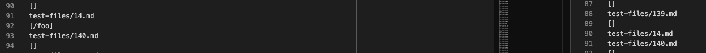
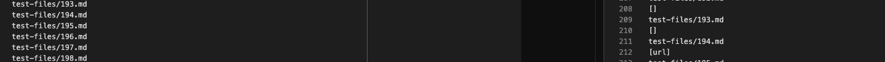

# Lab Report 5

**Different Answer #1**

(Left is the result of my implementation and right is the given one's result)

For test file 14, the given implementation of MarkdownParse
gave"/foo" while my implementation did not give any output. Since test file 14 was pretty early in the output document, I just searched and compared the two manually. In this case my implementation gave the right output since there is a forward slash in front of the lines in test file 14, causing them to not be recognized as links. To fix this, the getLinks method in the MarkdownParse.java file should check if there is a forward slash one index in front of the left bracket. 
**Different Answer #2**

(Left is the result of my implementation and right is the given one's result)

For test file 194, the given implementation of MarkdownParse resulted in "url" and my implementation of the same class did not give an output. I searched the testes manually. My implementation of MarkdownParse is also right in this case since the line corresponding to the output in the test file had characters
between the right bracket and left paranthesis, which results in it not being recognized as a link. The bug here is that the file does not check for characters between the brackets and parantheses. THis can be done by adding a if statement in the getLinks method that checks if the right bracket's index is only one greater than that of the left parantheses. 
